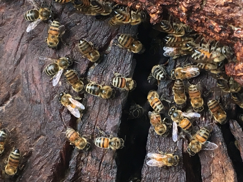
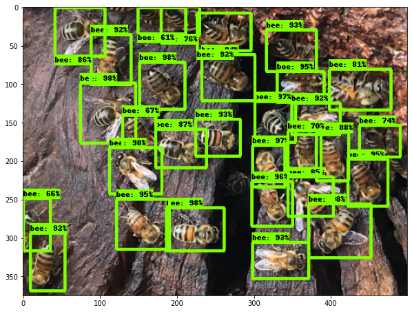

## TensorFlow 2 Object Detection API SageMaker

### Overview
In this repository, we use [Amazon SageMaker](https://aws.amazon.com/sagemaker) to build, train, and deploy an [EfficientDet](https://arxiv.org/abs/1911.09070) model using the [TensorFlow Object Detection API](https://github.com/tensorflow/models/tree/master/research/object_detection). It is built on top of TensorFlow 2 that makes it easy to construct, train and deploy object detection models.
It also provides the TensorFlow 2 Detection [Model Zoo](https://github.com/tensorflow/models/blob/master/research/object_detection/g3doc/tf2_detection_zoo.md) which is a collection of pre-trained detection models we can use to accelerate our endeavour.

This implementation shows how to do the following:
* Generate the dataset TFRecords and label map using SageMaker Processing
* Fine-tune an EfficientDet model with TF2 on Amazon SageMaker
* Monitor your model training with Tensorboard and SageMaker Debugger
* Deploy your model on a SageMaker Endpoint and visualize predictions

### Get started
Clone this repository into your Amazon SageMaker notebook instance:

```
git clone https://github.com/aws-samples/amazon-sagemaker-tensorflow-object-detection-api.git
```

Use the 0_set_up_env to set up a conda env with the necassry libraries.
This is to ensure the imports in the notebooks are working, the libraries used in the processing, training, deployement components are managed through docker containers.
If you have your own personal environement, feel free to skip but take a look at the 0_set_up_env/requirements.txt to know what to expect.

### Instructions
You will use an example dataset from the [inaturalist.org](http://inaturalist.org/) and train a Tensorflow Object Detection model to recognise bees from RGB images.
This dataset contains 500 images of bees that have been uploaded by inaturalist users for the purposes of recording the observation and identification. We only used images that their users have licensed under [CC0](https://creativecommons.org/share-your-work/public-domain/cc0/) license.

Follow the step-by-step guide by executing the notebooks in the following folders:
* 1_prepare_data/prepare_data.ipynb
* 2_train_model/train_model.ipynb
* 3_predict/deploy_endpoint.ipynb

|||
| -------------- | -------------- |
|||

### Monitor model training jobs with Tensorboard
SageMaker debugger allows you to [capture TensorBoard data](https://sagemaker.readthedocs.io/en/stable/amazon_sagemaker_debugger.html#capture-real-time-tensorboard-data-from-the-debugging-hook) into a chosen S3 location and monitor the training progress in real-time with TensorBoard.  
See 2_train_model/train_model.ipynb for command details.

You can start the TensorBoard server from your notebook with the following command:

```python
job_artifacts_path = estimator.latest_job_tensorboard_artifacts_path()
tensorboard_s3_output_path = f'{job_artifacts_path}/train'

!F_CPP_MIN_LOG_LEVEL=3 AWS_REGION=<ADD YOUR REGION HERE> tensorboard --logdir=$tensorboard_s3_output_path
```

TensorBoard server will run on your local notebook instance and you can open it by visiting the following url (the default port is typically 6006: 
```
https://your-notebook-instance-name.notebook.your-region.sagemaker.aws/proxy/6006/
```

## Security

See [CONTRIBUTING](CONTRIBUTING.md#security-issue-notifications) for more information.

## License

This library is licensed under the MIT-0 License. See the LICENSE file.

